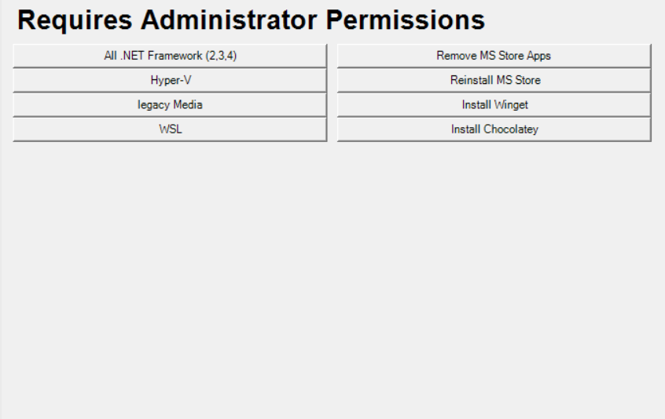
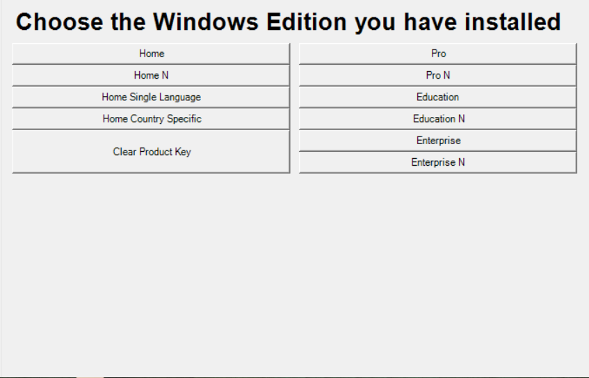

# efe-toolbox
My personal toolbox for windows 10+


## How to use

### Powershell
1. Download from [Here](https://github.com/Greninja9559/efe-toolbox/archive/refs/heads/main.zip)

2. Paste this into powershell as administrator ```Set-ExecutionPolicy Unrestricted``` to elevate your execution policy (May be dangerus to leave on permanently for a regular home user).

3. Execute script with powershell

4. (Optional) Paste this into powershell as administrator ```Set-ExecutionPolicy Default``` to return to default execution policy (Better for security).

### Exe

1. Download from [Here](https://github.com/Greninja9559/efe-toolbox/releases/download/toolbox/Toolbox.exe)

2. Run the executable


## Pictures






